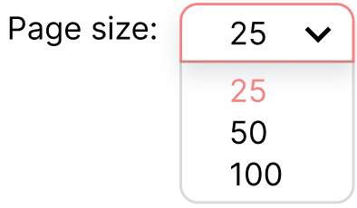

# HOMEWORK

Full list of homework for the course `Advanced JavaScript`. Each homework is divided into 3 parts: `Basic`, `Medium` and `Advanced`.

## Homework 1

### Basic
Place the JSON cars.json to your GitHub repository. Use the `fetch` method to get the data from the server. Display the cars data in a table.

### Medium

Add inputs to filter the data:
- By type (input type: select)
- By brand (input type: select)

Add a search button. When clicked the table should be filtered by the selected filters.

### Advanced
Add these additional inputs:

- By model (input type: text input)
- By doors (input type: number input)
- By gasType (input type: select)
- By color (input type: text OR select)
- By new/old (input type: radio or checkbox) - you are free to choose the input type and the way you want to display the data (just new, just old, both, etc.)
- By horsepower (input type: number, range input) - you are free to choose the input type and the way you want to display the data (exact value, up to value, etc.)

Make sure all filters are working together. When a filter is selected, it should be considered in the filtering process.

Example: if I select `BMW` from the brand filter, the table should be filtered by the selected brand. If I select `BMW` and color `white`, the table should be filtered by the selected brand and color.

### Bonus:
1. Add a button `Reset filters` to reset the table to its initial state (before any filtering was applied), and reset all filter inputs to default values.
2. If no data is found, display a message `No data found` instead of the table.
3. Use partial searching for the text inputs. Example: if I type `ol` in the model input, the table should be filtered by all cars that have `ol` in their model name (polo, volvo, etc.).

## Homework 2: BrewBuddy - Beer Recommendation App

### Objective
Develop a Beer Recommendation App, "BrewBuddy", by using everything we've learned so far. Fetch information about different beers and provide users with an interactive experience for discovering and learning about various brews.

### Beer Generator Page
1. On the first load of the application the user should see a randomly generated beer, displayed with an image and additional information that you find suitable (abv, ibv, description...). 

2. If the user does not like the choice, he is able to re-generate a new random beer with one click. 

3. Additionally, there should be a "View menu" button, that takes the user to a different page where all available beers are shown. 

### Menu Page
1. Show all available beers by using **pagination**. Set the default page size to 25 per page and add an option to change this by selecting values from a dropdown:

    

2. The user can **filter** beers who have ABV > 6%. Besides this, you should add 2 or more filters for properties of your choice. 

3. The user can **search** through the results.

4. The user can see various **food pairings** for any of the displayed beers.  

5. The user can access the random beer generator page from this one.

### Additional Implementation Details
1. #### User Interface (UI):
    * Implement a responsive layout for seamless use on various devices.
2. #### API Integration:
    * Utilize the [Punk API](https://punkapi.com/documentation/v2) to fetch beer data.
3. #### Error Handling:
    * Implement error handling for cases where API requests fail or when users search for non-existent beers.
    * Provide user-friendly error messages and feedback.

### Bonus
1. The search functionality should retrieve results while typing, without having to click a search button or 'Enter'.
2. For each of the abbreviations that are used, find a way to add the full definition of it. For example, abv - alcohol by volume. 